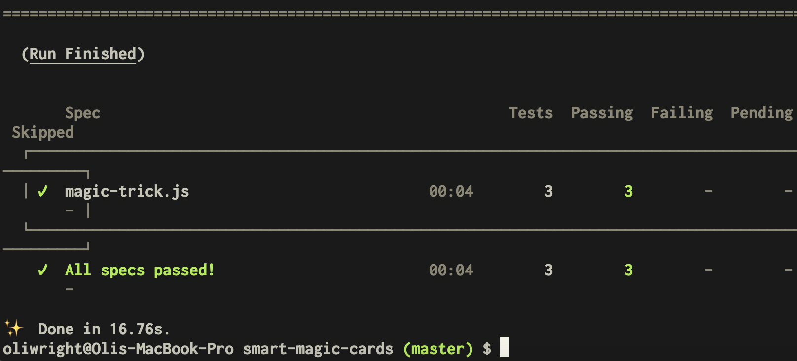
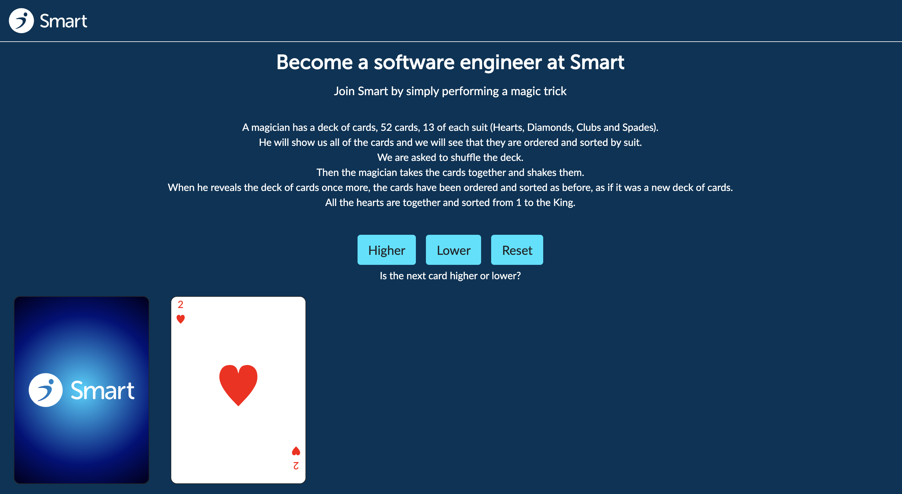

# Key Points Profile
## Rendering Cards

Each of the cards was rendered by looping over an array of all the suits and for each suit creating 13 divs with the 'card' class as well as the unique class for the card in the format '{suit}-{value}`. Inside the card div is a div with the class 'card-face'. This card face contains mark-up with classes allowing for the card values, colours, suit and layout to be generated using only css classes.

The card also contains an image of the Smart logo which is displayed when the card face is 'hidden', giving the apearence of the cards being an actual branded deck of cards.

## Shuffle/Magic functions

These functions work by changing the unique classes on the card to change their appearence, and also their absolute 'left' position to give the appearence that they have moved.

## Cypress tests

On top of the initial Cypress tests provided, i added a few more which tested whether the correct number of cards were rendered, whether the animation of stacking/unstacking the cards worked correctly, and whether the cards were randomly shuffled each time, as opposed as being shuffled to the same 'random order'

##### Results of initial cypress tests:


Unfortunately on addition of the Higher/Lower game (see below) i had an issue with the EsLint rule 'no use before defined' so the tests failed before the cypress test suite ran, so i was unable to test the Higher/Lower game. I am currently trying to find a solution for this issue.

## Higher/Lower

##### Results of initial cypress tests:

### Contributors
[Oliver Wright](https://github.com/oliwright1994)

# Original Brief:
## Smart Magic Cards
Join Smart by performing a simple magic trick.

### Requirements
- Make sure all 4 suits of cards are rendered. There are 13 cards in each suit (♥,   ♣, ♦, ♠).
- Add 3 buttons to the flow that will do 3 actions:
  - **Shuffle:** Randomly shuffles all cards.
  - **Show/Hide:** Hide all the cards by adding a class (CSS is already included).
  - **Magic:** Order the cards again by suit.

#### Bonus points
  - Find a way to automatically create all the classes for the cards: `.hearts-1`, `.hearts-2`, ... , `.spades-13`.
  - Make sure the value for each card is visible on the initial render, basically move each card a bit so the card is readable.
  - Add animation.
  - Remove all images and have the cards represented with CSS only.
  - Uncomment the tests in the `cypress/integration/magic-trick.js` file and make sure the tests pass.
  - Add additional tests (we like test coverage).
  - Add some extra functionality, this is your chance to be creative. 😉

#### Example


## Getting Started
Follow these steps to get the project setup on your machine.

### Clone the repository
```
git clone git@github.com:smartpension/smart-magic-cards.git
```
_Note:_ You won't have access to commit to this repository. We suggest you download it or fork it.


### Install
```
yarn install
```

### Develop
In order to use the SASS compiler, run the following command.
```
yarn develop
```

### Test
In order to run the tests, run the folowing command.
```
yarn test
```
_Note:_ [Cypress.io](https://www.cypress.io/) is included in the project and all tests will run on Travis CI.
